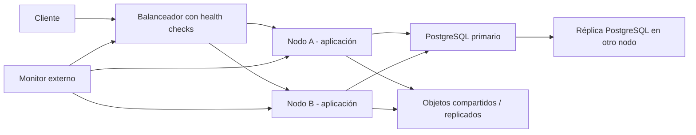

# Heartbeat y alta disponibilidad real

## Qué existe hoy

El heartbeat registra que un proceso está vivo, su rol, versión y última señal. Docker puede reiniciar un contenedor enfermo mediante `healthcheck` y política de reinicio. Esto mejora la recuperación de un proceso, pero **no es todavía un espejo de alta disponibilidad**.

Un segundo contenedor dentro del mismo VPS no protege contra caída del VPS, disco, red, proveedor o proxy. Por eso no se presenta como HA completa.

## Feature de espejo propuesto

Requisitos mínimos:

1. Dos VPS o zonas de fallo independientes.
2. Balanceador externo que retire nodos sin salud.
3. Aplicaciones sin estado local; sesiones en Redis compartido o tokens verificables.
4. PostgreSQL con replicación, promoción controlada, fencing y copias restauradas en prueba.
5. Archivos en almacenamiento de objetos compartido/replicado.
6. Migraciones compatibles con despliegue gradual.
7. Simulaciones documentadas de caída de nodo, base de datos, red y almacenamiento.

## Criterio para marcarlo funcional

Solo se considerará HA validada cuando una prueba elimine el nodo activo sin aviso, el balanceador continúe sirviendo sesiones nuevas, no haya doble escritura, la base promocionada conserve los datos y se mida RTO/RPO. Hasta entonces es un feature diseñado y observable, no una garantía de continuidad.

