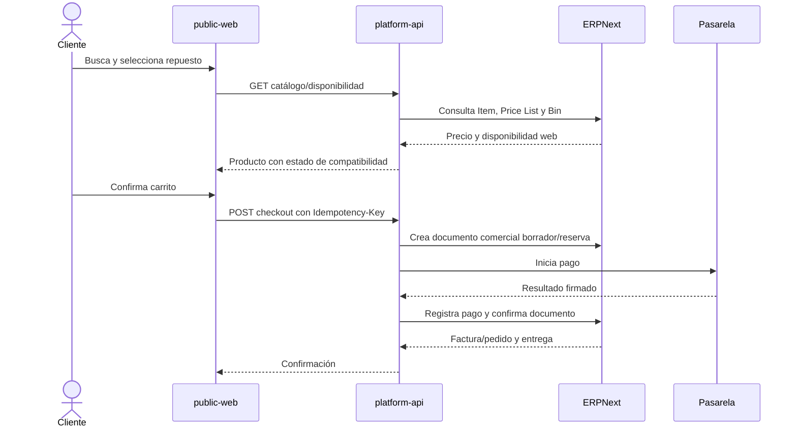
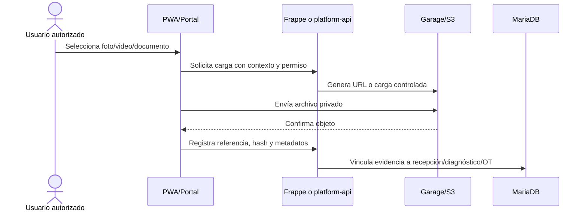

# Mapa de servicios

## Servicios de aplicación

| Servicio | Puerto interno | Datos que puede escribir | Dependencias |
|---|---:|---|---|
| Frappe backend | 8000 | ERPNext/SmartDiag en MariaDB | MariaDB, Valkey Frappe, Garage/S3 |
| Frappe websocket | 9000 | Ninguno persistente | Valkey Frappe |
| platform-api | 8080 | Eventos, idempotencia y solicitudes delegadas | Frappe API, PostgreSQL, Valkey, Garage/S3 |
| ai-gateway | 8090 | Auditoría IA | ChromaDB, PostgreSQL, Valkey, LLM |
| alerts-worker | sin puerto público | Alertas y estado de consumo | PostgreSQL, Valkey |
| public-web | 80 | Ninguno directo | platform-api |
| ops-web | 80 | Ninguno directo | platform-api, Frappe API |
| Caddy | 80/443 públicos | Ninguno | Frontends, API y Frappe |

## Servicios de datos

| Servicio | Puerto interno | Responsabilidad | Persistencia |
|---|---:|---|---|
| MariaDB | 3306 | Transacción ERP/Frappe | `mariadb-data` |
| PostgreSQL | 5432 | Eventos, alertas, idempotencia y auditoría IA | `postgres-data` |
| Valkey plataforma | 6379 | Streams, caché, locks y estado temporal | `redis-platform-data` |
| Valkey Frappe cache | 6379 | Caché regenerable de Frappe | `redis-cache-data` |
| Valkey Frappe queue | 6379 | Colas, realtime y jobs | `redis-queue-data` |
| ChromaDB | 8000 | Índice semántico; nunca ledger | `chroma-data` |
| Garage | 3900 S3 | Evidencias y documentos privados | `garage-meta`, `garage-data` |
| rclone `object-client` | efímero | Backup y restore S3 | sin volumen propio |

Los nombres `redis-*` se conservan para compatibilidad de configuración con Frappe, pero la implementación de esos servicios es Valkey. Ningún servicio de datos publica puertos al host.

`platform-api` expone `/ready` con estados de configuración —sin valores secretos— para PostgreSQL, Valkey, Garage/S3, Frappe y seguridad interna. Mientras los adaptadores productivos no estén habilitados, la especificación vigente exige tratar ese estado como un Gate de staging.

## Flujo de venta de repuesto

## Flujo de evidencia

