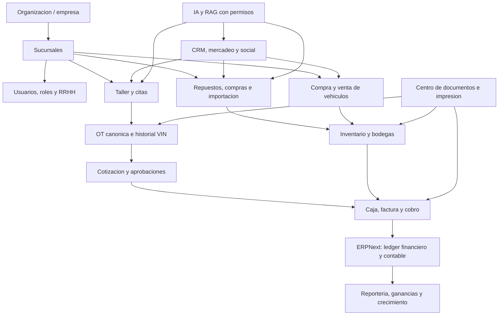

# SmartDiag504 - plan maestro para software integral de taller

**Fecha de corte:** 2026-08-13  
**Entorno revisado:** repositorio `smartdiag504-platform-v0.4.0` y demo en `taller.nexusmedi.org`  
**Objetivo:** convertir la demostracion actual en un producto estable, configurable y reutilizable para talleres, repuesteras y empresas con varias sucursales.

## 1. Dictamen ejecutivo

SmartDiag504 ya tiene una base valiosa: landing, portal cliente, citas, tienda, catalogo, OT/Kanban, fotografias de diagnostico, cotizaciones, caja, pedidos, bodega, calidad, CRM, publicidad, IA/RAG, eventos y despliegue Docker. No parte de cero.

Todavia no es un software empresarial completo porque faltan cinco fundamentos:

1. identidad individual, roles y segregacion real de funciones;
2. una sola fuente de verdad para OT, inventario, factura, caja y contabilidad;
3. aislamiento multiempresa y configuracion por organizacion/sucursal;
4. RRHH, compras/importacion, vehiculos usados y reportería gerencial profunda;
5. certificacion fiscal, contable, seguridad, respaldo y operacion productiva.

La arquitectura objetivo del repositorio establece ERPNext/Frappe como autoridad financiera y de inventario, y Beveren `Service Order` como OT canonica. Sin embargo, el Compose administrado de la demo mantiene `FRAPPE_REQUIRED=false`, `INVOICE_VERIFICATION_MODE=development` y modelos locales de OT, cotizacion, pago y stock en PostgreSQL. Esta diferencia es deuda de transicion: sirve para probar UX, pero no debe convertirse en un segundo ERP ni declararse contabilidad certificada.

## 2. Mapa del producto objetivo



## 3. Que existe hoy

### 3.1 Funcional y probado en la demo

| Dominio | Capacidad existente | Evidencia principal |
|---|---|---|
| Marca y web | Landing, servicios, tienda, logo cargado, carrito, reserva y chatbot | `apps/public-web` |
| Cliente | Login demo, vehiculos, citas, repuestos compatibles, alertas, cotizaciones, facturas y configuracion | `client_portal.py`, `CustomerExperience.tsx` |
| Citas | Cita publica y autenticada, disponibilidad, fuente y confirmacion | `client_appointments.py`, `work_orders.py` |
| Taller | Kanban, seis estados, detalle OT, diagnostico, repuestos e historial | `work_orders.py`, `WorkOrderDetail.tsx` |
| Evidencia | Fotos JPG/PNG/WebP ligadas a OT y diagnostico PDF | `work_orders.py`, `documents.py` |
| Cotizacion | Busqueda por VIN/placa/dueno, lineas, aprobacion y conversion a OT | `finance.py`, `FinanceViews.tsx` |
| Caja demo | Apertura, codigo de cajera, pagos, arqueo, cierre y documentos PDF | `finance.py`, `FinanceViews.tsx` |
| Repuestos | Catalogo, compatibilidad, Excel, fotos, precios demo y pedidos web | `admin_catalog.py`, `catalog_import.py`, `store.py` |
| Bodega operativa | Solicitud, picking, entrega, devolucion, recepcion y PDF | `operations_control.py`, `RoleViews.tsx` |
| Logistica | Bodegas de stock/proceso/transito/devolucion, transferencias y fletes | `operations_control.py` |
| Calidad | Casos, estados, evidencia, resolucion e historial VIN | `QualityCase`, `ProcessControlView` |
| CRM | Leads, Kanban, actividades, seguimiento, WhatsApp manual y encuestas | `SalesLead`, `LeadsKanbanView` |
| Mercadeo | Campanas, medios, enlaces medibles y pantalla publicitaria | `marketing.py` |
| Analitica operativa | Eventos, heatmap de flujo, heartbeats y estado de nodos | `FlowEvent`, `heartbeat.py` |
| IA | Chat seguro, modo determinista/Ollama/LLM y RAG controlado | `services/ai-gateway`, `chat.py` |

### 3.2 Parcial: existe la forma, falta profundidad empresarial

| Modulo | Lo que ya hay | Lo que falta para considerarlo completo |
|---|---|---|
| Citas | Agenda y slots | capacidad por tecnico/bahia, recurrencia, lista de espera, recordatorios externos y no-show |
| Taller | OT y Kanban | check-in completo, DTC estructurado, tiempos reales, operaciones, firma, SLA y conciliacion con OT canonica ERP |
| Caja | flujo y reporte por turno | factura fiscal, notas de credito, devoluciones monetarias, bancos, POS real, cierres por terminal y conciliacion ERP |
| Bodega | estados y documentos | stock ledger real, lotes/series, conteo ciclico, ajustes aprobados, min/max, costo promedio y trazabilidad ERP |
| CRM | lead y actividades | segmentacion, consentimientos, automatizaciones, pipeline por producto, metas, tareas, campanas y atribucion |
| Marketing | creador y enlace | calendario, presupuesto, audiencias, aprobacion, conversion/ROI y conectores Meta/WhatsApp/email |
| Gerencia | sucursales y documentos | tablero ejecutivo, presupuesto, permisos, parametrizacion fiscal y configuracion completa por empresa |
| Cliente | perfil demo y documentos | identidad productiva, recuperacion, MFA real, pagos, garantias, puntos y privacidad por objeto |
| IA/RAG | infraestructura y guardas | corpus tecnico curado, citas de fuente, evaluaciones, permisos por empresa y observabilidad de calidad |

### 3.3 No implementado como modulo completo

- RRHH, expedientes, asistencia, vacaciones, evaluaciones, capacitacion, planilla y comisiones.
- Contabilidad productiva integrada y certificada: libro diario, mayor, balance, P&G, flujo de efectivo y cierres.
- Compra y venta de vehiculos usados, tasacion, inspeccion, reacondicionamiento y rentabilidad por unidad.
- Importacion completa con orden internacional, costos landed, aduana, embarque y recepcion.
- Centro de impresion parametrizable para documentos fiscales, termicos, etiquetas, QR y formatos corporativos.
- Presupuestos, metas y reportería consolidada multiempresa.
- Identidad/RBAC productiva y doble aprobacion para operaciones sensibles.
- Plataforma SaaS multiempresa con aislamiento, planes, limites, onboarding y actualizaciones controladas.

## 4. Principios no negociables

1. **Una sola OT:** Beveren/SmartDiag Frappe debe ser la OT canonica. PostgreSQL conserva proyeccion y eventos, no otra verdad transaccional.
2. **Un solo inventario valorizado:** ERPNext controla Item, Bin, Stock Ledger, recepciones, transferencias, consumos y devoluciones.
3. **Un solo libro contable:** asientos, facturas, pagos, impuestos, cuentas por cobrar/pagar y cierres viven en ERPNext.
4. **Idempotencia:** cada integracion usa referencia externa unica y puede reintentarse sin duplicar documentos.
5. **Aislamiento empresarial:** toda operacion pertenece a organizacion, empresa legal, sucursal y, cuando aplique, bodega/caja.
6. **Segregacion:** quien cotiza no necesariamente aprueba descuentos; quien cobra no modifica costos; quien recibe no autoriza su propio ajuste.
7. **Auditoria:** actor, fecha, origen, cambio anterior/nuevo, motivo y referencia de documento.
8. **Configuracion sobre forks:** ninguna empresa cliente debe necesitar una copia distinta del codigo.

## 5. Fundacion multiempresa y configuracion

### 5.1 Modelo requerido

```text
Tenant/Organizacion
  -> Empresa legal
     -> Sucursal
        -> Taller / bahias
        -> Bodegas
        -> Cajas / terminales
        -> Empleados y roles
        -> Series y plantillas documentales
```

La opcion recomendada para clientes independientes es **un sitio Frappe por organizacion**, con base y archivos aislados. Dentro de una organizacion pueden existir varias empresas legales y sucursales. Un `tenant_id` compartido en una sola tabla solo debe usarse si se implementan y prueban RLS, claves compuestas, backups por tenant y pruebas de no cruce; para datos financieros, el aislamiento por sitio es mas simple y seguro.

### 5.2 Centro de configuracion

| Grupo | Parametros |
|---|---|
| Empresa | razon social, nombre comercial, RTN, direccion, moneda, zona horaria, idioma |
| Marca | logo horizontal, isotipo, favicon, colores, tipografia, lema y fondos |
| Fiscal | CAI, rangos, fechas limite, impuestos, exoneraciones, correlativos y leyendas |
| Taller | estados habilitados, horarios, capacidad, bahias, tipos de servicio y SLA |
| Catalogos | mano de obra, vehiculos, repuestos, compatibilidad, listas de precios y costos |
| Inventario | bodegas, ubicaciones, lotes/series, min/max, metodos de valoracion y conteos |
| Caja | terminales, fondo, limites, medios de pago, tolerancias y doble aprobacion |
| Documentos | plantillas, papel carta/A4/80mm/58mm, copias, firmas, QR y pie legal |
| Usuarios | roles, permisos, MFA, limites de descuento y montos de aprobacion |
| Comunicacion | remitentes, WhatsApp, correo, SMS, horarios, consentimientos y plantillas |
| Features | taller, tienda, usados, importacion, RRHH, CRM, IA, lealtad y credito |

Toda configuracion debe tener version, vigencia, auditoria, valor por defecto y posibilidad de herencia `organizacion -> sucursal -> terminal`.

## 6. Expansion detallada por modulo

### 6.1 Identidad, usuarios y seguridad

**Falta prioritaria:** reemplazar el token administrativo compartido por usuarios individuales.

- Login seguro, recuperacion y MFA real.
- Roles base: propietario, gerencia, contador, RRHH, asesor, tecnico, supervisor, bodega, compras, caja, marketing y auditor.
- Permisos por empresa/sucursal/bodega/caja y por objeto.
- Limites por monto, descuento, devolucion, ajuste y cierre.
- Sesiones, bloqueo, revocacion, dispositivos y auditoria.
- Matriz de incompatibilidades y doble autorizacion.

**Criterio de terminado:** un tecnico no puede ver margen ni cerrar caja; una cajera no cambia costos; un empleado de una sucursal no accede a otra sin asignacion.

### 6.2 RRHH y productividad

- Expediente: identidad, contacto, emergencia, contrato, puesto, sucursal y documentos.
- Turnos, marcacion, tardanzas, horas extra, permisos, vacaciones e incapacidades.
- Habilidades y certificaciones por marca/sistema; vencimientos y capacitacion.
- Asignacion de tecnicos segun capacidad, habilidad, bahia y carga.
- Tiempos productivos, improductivos, pausas, retrabajos y eficiencia.
- Metas y comisiones por mano de obra, repuestos, ventas, calidad y cobranza.
- Evaluacion, incidentes, equipo entregado y offboarding.
- Planilla debe integrarse con el modulo correspondiente de ERPNext; no crear calculos contables aislados.

**Reportes:** asistencia, costo laboral por OT, productividad, eficiencia, utilizacion, horas vendidas vs trabajadas, comisiones y rotacion.

### 6.3 Citas y recepcion

- Calendario por sucursal, servicio, tecnico, bahia y equipo.
- Duracion estandar desde catalogo de mano de obra.
- Reglas de cupo, feriados, bloqueos, sobrecupo autorizado y lista de espera.
- Confirmacion, recordatorio, reprogramacion, cancelacion y no-show.
- Check-in: odometro, combustible, accesorios, danos, fotos 360, firma y consentimiento.
- Cita publica, portal, telefono, WhatsApp y walk-in conservan fuente separada.
- La cita confirmada se convierte en recepcion y luego en la OT canonica.

**KPIs:** ocupacion futura, conversion cita->visita, no-show, espera, tiempo de recepcion y canal de origen.

### 6.4 Taller, diagnostico y OT

- Inspecciones configurables por tipo de vehiculo/servicio.
- DTC, sintomas, pruebas, valores esperados/reales, causa probable/confirmada y severidad.
- Fotos/video antes, durante y despues; anotaciones y evidencia de calidad.
- Operaciones de mano de obra con codigo, vehiculo aplicable, tiempo estandar, costo y venta.
- Asignacion multiple, cronometro, pausas, bloqueo, dependencia y trabajo externo.
- Repuestos solicitados, reservados, entregados, consumidos y devueltos.
- Trabajos adicionales generan nueva version de cotizacion y nueva aprobacion.
- QC, prueba de ruta, firma del supervisor, garantia y pase de salida.
- Historial completo por VIN, propietario, kilometraje, reclamos y mantenimiento futuro.

**Criterio de terminado:** ninguna linea no aprobada llega a factura; toda pieza facturada se concilia con entrega/consumo; la OT cierra con QC y evidencia.

### 6.5 Cotizaciones y aprobaciones

- Busqueda por VIN, placa, cliente o cita.
- Versiones inmutables, vigencia, listas de precio, impuestos y moneda.
- Mano de obra, repuestos, subcontratos, consumibles, descuentos y cargos.
- Costo/margen solo para roles autorizados.
- Aprobacion/rechazo por linea, firma, IP/canal, fecha y comentario.
- Escalamiento de descuentos y margen minimo.
- Convertir cotizacion aprobada a OT o Sales Order sin duplicar.
- HTML canonico y PDF derivado de la misma plantilla.

### 6.6 Repuestos, compras y proveedores

- Maestro SKU/OEM/alternos, marca, categoria, unidad, compatibilidad y equivalencias.
- Fotos exactas por numero de parte; la imagen generica solo funciona como placeholder de demo.
- Proveedores, listas, plazos, minimos, calidad y devoluciones.
- Solicitud de compra, comparativo, orden, recepcion, factura y pago ERP.
- Reorden, stock de seguridad, lento movimiento, obsolescencia y conteos.
- Core/pieza usada, consignacion, kits y repuestos reparables.
- Codigos QR/barra para recibir, ubicar, recoger, entregar y contar.

### 6.7 Bodega e inventario

- Multiples bodegas y ubicaciones: stock, proceso, transito, devoluciones, consignacion y cuarentena.
- Kanban por OT y por pedido, pero los movimientos reales se registran mediante documentos ERPNext.
- Picking por ubicacion/ruta, validacion por escaneo y responsable.
- Reservas con vencimiento y liberacion automatica.
- Transferencia con salida, transito, recepcion y diferencia.
- Entrada, devolucion, ajuste y conteo requieren motivo y autorizacion.
- Lotes, series, costo, caducidad y trazabilidad cuando aplique.

**Reportes:** existencia, valorizacion, rotacion, cobertura, faltantes, exactitud, diferencias, fill-rate y aging.

### 6.8 Importacion

- Solicitud y aprobacion de compra internacional.
- Proforma, proveedor, moneda, incoterm, agente, embarque y ETA.
- Documentos: factura, packing list, BL/guia, permisos, poliza y aduana.
- Costos landed: flete, seguro, arancel, impuesto, almacenaje y honorarios.
- Distribucion del costo por valor, peso, volumen o cantidad.
- Recepcion parcial, discrepancias, reclamo y cuarentena.
- Conversión monetaria y asiento final en ERPNext.

**Criterio de terminado:** costo unitario importado concilia con documentos y libro mayor; no se edita manualmente sin auditoria.

### 6.9 Tienda y venta de repuestos

- Catalogo SEO con compatibilidad, precio, existencia real y disponibilidad por sucursal.
- Busqueda por VIN/vehiculo, equivalencias y validacion humana cuando no hay certeza.
- Carrito, reserva, pago, retiro, entrega y pedido especial.
- Impuestos, cupones, promociones, devoluciones, reembolso y garantia.
- Estados Kanban: entrado, contactado, confirmado, pagado, reservado, preparando, enviado, entregado, no responde, perdido y devuelto.
- Integracion con transportistas, guia, foto, tracking y evidencia de entrega.
- Venta nocturna conserva reserva condicionada y mensaje de confirmacion en horario habil.

### 6.10 Compra y venta de vehiculos usados

- Lead de compra/venta, vehiculo, VIN, propietario y documentos.
- Tasacion comercial y tecnica con fotos, inspeccion, escaner, prueba de ruta e historial.
- Oferta, negociacion, autorizacion y contrato.
- Compra, consignacion, trade-in o intermediacion.
- Ingreso a inventario de vehiculos y ubicacion fisica.
- Reacondicionamiento mediante OT interna con presupuesto y costo real.
- Expediente legal, traspaso, gravamen y procedencia; requisitos finales requieren revision legal local.
- Publicacion multicanal, prospectos, test drive, reserva, financiamiento y venta.
- Rentabilidad por unidad: compra + reacondicionamiento + gastos + comision + financiamiento vs venta.

**Regla:** repuestos y mano de obra usados para reacondicionar deben salir de inventario y acumularse como costo de la unidad, no desaparecer como gasto sin referencia.

### 6.11 Caja, POS y tesoreria

- Kanban de OTs/pedidos listos para cobro y detalle antes del pago.
- Cajas y terminales por sucursal; apertura, fondo, movimientos, retiros, ingresos y cierre.
- Cajero identificado, codigo/PIN, MFA para excepciones y relevo de turno.
- Efectivo, tarjeta, transferencia, enlace, credito, anticipo, parcial y mixto.
- POS/adquirente mediante adaptador; nunca almacenar PAN/CVV.
- Factura, recibo, nota de credito, devolucion, garantia y pase de salida.
- Conciliacion contra terminal, banco y ERP; diferencias con aprobacion.
- Arqueo ciego opcional y cierre diario consolidado.

### 6.12 Centro de documentos e impresion

- Motor unico HTML -> PDF/impresion.
- Plantillas versionadas por empresa/sucursal/tipo.
- Formatos carta, A4, termico 80/58 mm, etiqueta y QR.
- Cotizacion, diagnostico, OT, factura, recibo, garantia, picking, entrega, devolucion, pase de salida, contrato y cartas.
- Logo, direccion, RTN, CAI, rango, leyendas, firmas, numeracion y copias configurables.
- Perfil de impresora por terminal; cola, reintento y registro de impresion.
- Prueba fisica obligatoria por modelo/controlador; un PDF correcto no certifica gaveta, corte o margenes termicos.

### 6.13 Contabilidad y estabilidad financiera

ERPNext debe proporcionar:

- plan de cuentas por empresa;
- libro diario y mayor;
- cuentas por cobrar/pagar;
- ventas, compras, impuestos, retenciones y notas;
- bancos, conciliacion, cajas y anticipos;
- activos, gastos, centros de costo y presupuestos;
- balance general, P&G y flujo de efectivo;
- periodos, cierres, reversos y auditoria.

SmartDiag504 debe agregar dimensiones automotrices a los documentos: sucursal, OT, VIN, tecnico, asesor, servicio, repuesto, campaña y unidad usada. No debe calcular un libro paralelo.

**Pendiente de definicion:** el usuario menciona `DMC`; no se encontro una definicion canonica en el repositorio. Debe aclararse el nombre legal/contable antes de crear tablas, pantallas o reportes con ese termino.

**Gate contable:** saldos iniciales, impuestos, factura, notas, pagos, inventario, costo de venta y cierres deben conciliar con un contador hondureno y pruebas de restauracion antes de produccion.

### 6.14 Reporteria, ganancias y crecimiento

Tres niveles:

1. **Operativo en tiempo real:** citas, bahias, OT atrasadas, repuestos pendientes, caja y entregas.
2. **Gerencial:** ventas, margen, capacidad, productividad, conversion, calidad, inventario y campañas.
3. **Contable:** P&G, balance, flujo, cartera, proveedores, impuestos y presupuesto desde ERPNext.

| Tablero | Indicadores minimos |
|---|---|
| Taller | ticket promedio, horas vendidas/trabajadas, ocupacion, ciclo OT, entregas a tiempo |
| Comercial | leads, conversion, cotizacion aprobada, ventas por canal/asesor/sucursal |
| Repuestos | margen, rotacion, fill-rate, faltantes, aging, devoluciones y ventas online |
| Calidad | comeback, retrabajo, garantia, costo de no calidad, causa raiz |
| Caja | cobro por medio, diferencias, devoluciones, cuentas pendientes y conciliacion |
| Marketing | costo por lead, fuente, conversion, ingreso y ROI por campaña |
| RRHH | asistencia, productividad, eficiencia, comisiones, capacitacion y rotacion |
| Usados | dias en inventario, costo reacondicionamiento, margen/unidad y conversion test drive |
| Gerencia | ingreso, margen bruto, EBITDA operativo definido, crecimiento, presupuesto vs real |

Los datos deben tener diccionario de metricas: formula, fuente, granularidad, zona horaria, moneda, exclusiones y fecha de actualizacion.

### 6.15 CRM, mercadeo y social

- Pipeline separado para taller, repuestos, flotas y vehiculos usados.
- Captura manual, landing, tienda, IA, telefono, WhatsApp, redes y referidos.
- Propietario, tarea, proxima accion, SLA, interes, presupuesto, vehiculo y consentimiento.
- Segmentos por VIN, mantenimiento, compra, abandono y valor del cliente.
- Campanas, audiencias, presupuesto, piezas, enlaces UTM, conversion y ROI.
- Encuestas postservicio, NPS/CSAT, reseñas y recuperacion de clientes.
- Meta/WhatsApp/email mediante adaptadores y webhooks; requiere cuentas y credenciales del negocio.
- IA puede clasificar y redactar, pero no enviar campañas ni aplicar descuentos sin reglas y permiso.

### 6.16 IA y conocimiento tecnico

- RAG por marca/modelo/motor/año con manuales autorizados y control de licencia.
- Citas de fuente, pagina, version y fecha.
- Busqueda por VIN, DTC, sintoma y casos similares anonimizados.
- Asistente tecnico separado del asistente comercial.
- Guardas contra extraccion de prompt, secretos y datos de otros clientes.
- Herramientas de lectura por defecto; escrituras requieren permiso, confirmacion y auditoria.
- Evaluaciones de precision, cobertura, latencia, costo y respuestas inseguras.

## 7. Correccion de marca y logo

### Diagnostico encontrado

- El archivo `smartdiag504-logo.png` es el logo entregado, pero conserva un lienzo blanco cuadrado de 958 x 958 y mucho espacio vacio.
- Se muestra en contenedores de solo 132-148 px, por lo que el contenido util queda visualmente pequeño.
- Operaciones aplica `filter: brightness(0) invert(1)`, lo que destruye los colores rojo/negro y puede convertir el lienzo opaco en un bloque poco legible.
- La guia de marca describe una paleta azul/cian provisional diferente del logo rojo/negro entregado. Hay dos direcciones visuales compitiendo.

### Trabajo P0

1. aprobar el logo rojo/negro entregado como marca canonica o aprobar formalmente una nueva direccion;
2. recortar el lienzo al contenido y retirar el fondo de verdad;
3. generar PNG transparente y SVG limpio;
4. crear horizontal, isotipo, claro, oscuro, monocromo, favicon y PWA;
5. eliminar filtros CSS destructivos;
6. definir tamaños minimos y fondos permitidos;
7. usar la marca en login, sidebar, landing, PDFs, email, TV, facturas y configuracion;
8. almacenar `brand assets` por empresa, no copiarlos manualmente a cada frontend.

**Criterio visual:** el logo debe ser reconocible a 120 px, conservar rojo/negro sobre fondo claro y usar una variante aprobada sobre fondo oscuro.

## 8. Arquitectura reusable recomendada

```text
apps/
  public-web        experiencia publica configurable
  ops-web           shell operacional por permisos/features
packages/
  design-system     tokens, marca y componentes compartidos
  domain            reglas puras, estados, dinero e idempotencia
services/
  platform-api      BFF, proyecciones y adaptadores; no ledger
  ai-gateway        IA/RAG y herramientas seguras
frappe-apps/
  smartdiag_workshop dominio automotriz y ERP
connectors/
  payments          adaptadores POS/pasarela
  messaging         WhatsApp/email/SMS
  logistics         transportistas
  identity          proveedor de identidad
config/
  defaults          esquemas y valores base
  feature-flags     capacidades por plan/empresa
```

Cada modulo debe exponer:

- contrato/API versionado;
- permisos requeridos;
- eventos que produce/consume;
- migracion de datos;
- configuracion validada;
- pruebas unitarias, integracion y navegador;
- metricas/logs;
- politica de respaldo/retencion;
- documentacion de operacion.

## 9. Roadmap recomendado

### Fase 0 - verdad, identidad y marca (4-8 semanas)

- corregir logo y sistema de marca;
- usuarios individuales, RBAC y MFA administrativo;
- activar/certificar ERPNext/Frappe en staging;
- definir OT canonica y retirar escrituras financieras paralelas;
- facturacion/caja/inventario conciliados;
- backup restaurable, observabilidad y hardening.

**Salida:** piloto controlado de una sucursal con datos reales y cierre diario conciliado.

### Fase 1 - taller completo (6-10 semanas)

- capacidad de citas y recepcion 360;
- diagnostico estructurado, tiempos y asignaciones;
- catalogos de mano de obra/repuestos;
- bodega ERP, QC, garantia y entrega;
- documentos/impresion configurables;
- portal con aprobacion y notificaciones reales.

**Salida:** cita -> OT -> aprobacion -> trabajo -> repuestos -> QC -> factura -> pago -> historial VIN.

### Fase 2 - negocio y crecimiento (6-10 semanas)

- compras/proveedores/importacion;
- CRM, campañas, encuestas y atribucion;
- reportería gerencial y rentabilidad;
- RRHH operativo, productividad y comisiones;
- tienda con pagos/logistica reales.

### Fase 3 - usados y multiempresa (8-14 semanas)

- compra/consignacion/venta de usados;
- reacondicionamiento y costo por unidad;
- onboarding multiempresa, aislamiento, branding, planes y limites;
- consolidacion gerencial entre sucursales/empresas.

### Fase 4 - diferenciadores (continuo)

- IA tecnica con corpus autorizado;
- mantenimiento predictivo;
- flotas y contratos empresariales;
- app movil/PWA offline controlada;
- automatizacion avanzada con aprobacion humana.

## 10. Priorizacion de modulos

| Prioridad | Modulos | Razon |
|---|---|---|
| P0 | identidad, ERPNext/Frappe, OT canonica, inventario, caja/fiscal, backups, marca | integridad, seguridad y confianza |
| P1 | taller profundo, citas/capacidad, bodega, compras, RRHH operativo, reportería | operacion completa y rentabilidad |
| P1 comercial | tienda, CRM, marketing, notificaciones | crecimiento y servicio al cliente |
| P2 | importacion avanzada, usados, fidelidad, credito | nuevas lineas de negocio |
| P2 plataforma | multiempresa SaaS, planes, metering, soporte | reutilizacion comercial |
| P3 | automatizacion e IA avanzada | diferenciacion despues de datos confiables |

## 11. Definition of Done por modulo

Un modulo no esta terminado porque tenga pantalla o tarjeta. Debe cumplir:

1. flujo completo con estados y transiciones validas;
2. persistencia en el sistema autoritativo;
3. permisos y aislamiento probados;
4. auditoria e idempotencia;
5. documentos y notificaciones cuando apliquen;
6. errores, reintentos y recuperacion;
7. pruebas unitarias, integracion y navegador;
8. metricas y alertas;
9. reporte de conciliacion;
10. documentacion funcional, tecnica y operativa;
11. prueba sobre el runtime servido, no solo HTTP 200;
12. backup/restore de los datos que el modulo crea.

## 12. Riesgos y decisiones pendientes

| Riesgo/decision | Tratamiento |
|---|---|
| Demo local se vuelve un ERP paralelo | congelar nuevas escrituras financieras locales y migrar por adaptadores Frappe |
| Dos OT distintas | elegir y certificar Beveren `Service Order` como canonica |
| Cruce de datos entre empresas | aislamiento por sitio y pruebas automatizadas de autorizacion |
| Contabilidad/fiscalidad incorrecta | validacion con contador/asesor fiscal hondureno y staging con datos controlados |
| Fraude interno | RBAC, segregacion, MFA, limites y doble aprobacion |
| Fotos/documentos expuestos | storage privado, autorizacion por objeto, antivirus, hash y retencion |
| Dependencia de proveedores | interfaces/adaptadores, webhooks idempotentes y modo degradado |
| Catalogo generico | gobernanza de datos, fotos exactas, compatibilidad y responsable de calidad |
| Marca inconsistente | aprobar logo canonico y usar activos centralizados configurables |
| Termino `DMC` ambiguo | aclarar significado antes de modelarlo |

### Limpieza tecnica y UX transversal

- Agrupar la navegacion actual por dominios: Inicio, Taller, Ventas, Inventario, Finanzas, Personas, Mercadeo, Inteligencia/Reportes y Configuracion.
- Conservar rutas demo como alias, pero crear rutas canonicas legibles; `/3gj`, `/publicida` y `/lading` no deben ser la taxonomia permanente del producto.
- Eliminar actores fijos como `tecnico-demo`, `cajero-demo` y `asesor-demo`; deben provenir de la sesion autenticada.
- Reemplazar KPI hardcodeados de administracion por consultas con fuente, periodo y fecha de actualizacion.
- Retirar componentes `Legacy*` despues de validar que no tengan consumidores.
- Corregir texto mojibake como `Diagnóstico` y declarar UTF-8 como gate de build/contenido.
- Convertir el buscador superior en busqueda global real por OT, VIN, placa, cliente, SKU, pedido y factura.
- Añadir estados de carga, vacio, error, permisos y modo degradado a todos los modulos.
- Probar marketing, CRM, calidad, gerencia, social, flujos y configuracion con la misma profundidad que OT/caja.
- El Hub Social actual es una superficie visual/politica, no un inbox real; no debe etiquetarse como integracion Meta activa.
- Los heartbeats/restart de una VPS no son alta disponibilidad: HA real requiere segundo host, replica de datos, quorum/failover y simulacro.

## 13. Proximos entregables concretos

El desglose ejecutable de UX, fotografias de OT, historiales, plantillas editables, impresion, APIs, migraciones y pruebas se mantiene en [PLAN_IMPLEMENTACION_MODULOS_UX_DATOS_DOCUMENTOS_2026-08-13.md](./PLAN_IMPLEMENTACION_MODULOS_UX_DATOS_DOCUMENTOS_2026-08-13.md).

1. `ARCHITECTURE.md` vivo con componentes, despliegue y propiedad de datos.
2. ADR de convergencia demo -> ERPNext/Frappe y estrategia de migracion.
3. matriz de roles/permisos/aprobaciones.
4. modelo de organizacion/empresa/sucursal/bodega/caja.
5. catalogo de configuraciones con esquema, default, herencia y auditoria.
6. paquete de marca corregido y aplicado a web/PDF/impresion.
7. backlog por epicas con historias y criterios de aceptacion.
8. diccionario de KPIs y fuentes contables.
9. plan de pruebas fiscales, contables, hardware y recuperacion.
10. piloto de una sucursal con cierre diario y restauracion comprobada.

## 14. Fuentes revisadas

- `README.md`
- `SMARTDIAG504_IMPLEMENTATION_MASTER.md`
- `SMARTDIAG504_ESTADO_ACTUAL.md` (snapshot historico; parte de su estado ya fue superado)
- `docs/architecture/DATA_OWNERSHIP.md`
- `docs/architecture/service-map.md`
- `docs/backlog/EPICS.md`
- `docs/operations/MODULE_MASTER_CATALOG_2026-08-13.md`
- `docs/operations/MODULE_FUNCTIONAL_MATRIX_2026-08-13.md`
- `docs/brand/BRAND_SYSTEM.md`
- `docs/security/THREAT_MODEL.md`
- `services/platform-api/app/models.py`
- `services/platform-api/app/routes/`
- `apps/ops-web/src/`
- `apps/public-web/src/`
- `compose.coolify-managed.yaml`

Este documento es un mapa de producto y arquitectura, no una certificacion fiscal. Cualquier requisito legal, laboral, contable o de compraventa de vehiculos debe validarse con profesionales autorizados en Honduras antes de activarse en produccion.
