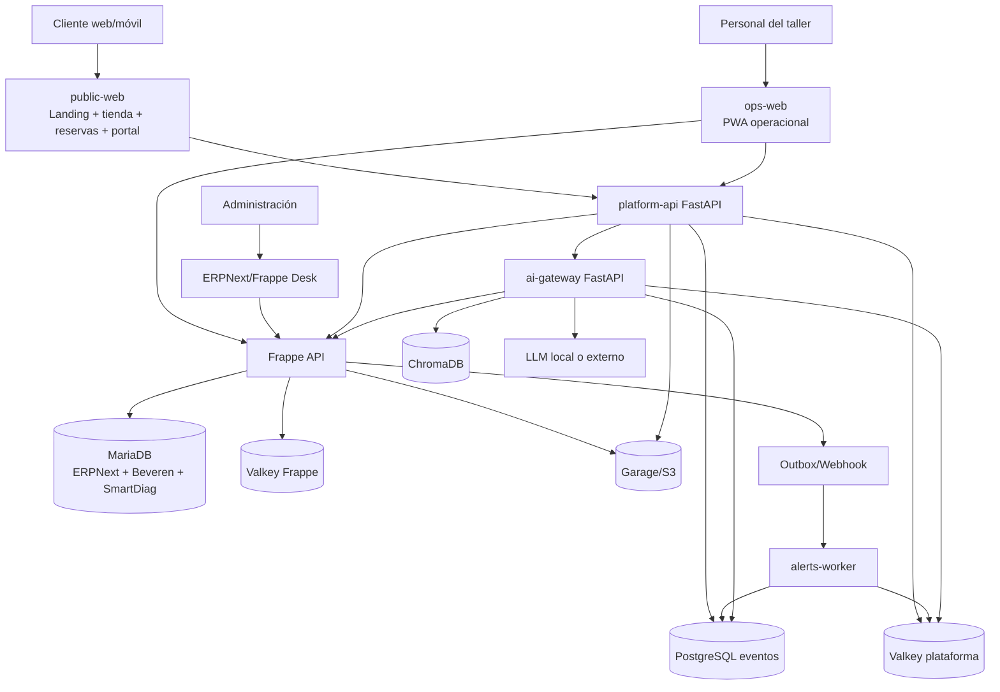

# SmartDiag504 Platform — Diseño técnico aprobado

**Fecha:** 12 de agosto de 2026  
**Versión:** 0.2  
**Decisión aprobada:** ERPNext v16 + fork estabilizado de Beveren FSM + aplicación automotriz SmartDiag504 + frontends propios + servicios separados de IA y alertas.

## 1. Objetivo

Construir un monorepo profesional que permita desarrollar, probar y desplegar en una VPS la plataforma completa de SmartDiag504:

- operación del taller;
- recepción e historial por vehículo/VIN;
- cotización, mano de obra, técnicos y bahías;
- repuestos, bodega, compras, POS, caja, facturación y contabilidad;
- landing page, reserva de citas y tienda de repuestos;
- portal del cliente;
- alertas operativas;
- IA con LLM, Valkey y ChromaDB;
- evidencias en almacenamiento de objetos;
- despliegue Docker, copias de seguridad, observabilidad y CI.

## 2. Principios no negociables

1. **ERPNext es la fuente de verdad financiera y logística.** Artículos, precios, existencias, compras, documentos fiscales, pagos, caja y contabilidad no se duplican en otro motor.
2. **Beveren FSM proporciona el flujo base de servicio**, pero se consume desde un fork controlado, versionado y probado por SmartDiag504.
3. **La OT central continúa siendo `Service Order`.** `smartdiag_workshop` la extiende; no crea otra OT paralela.
4. **MariaDB almacena la operación transaccional de ERPNext/Frappe.**
5. **PostgreSQL solo almacena eventos, alertas, auditoría de herramientas de IA e idempotencia.** No controla inventario, pagos ni facturas.
6. **ChromaDB solo indexa conocimiento autorizado.**
7. **Valkey conserva estado temporal, colas, caché y streams; nunca es la única copia de un dato de negocio.**
8. **Garage/S3 conserva fotos, videos, archivos de escáner, firmas y documentos.**
9. **Toda escritura sensible requiere usuario, permiso, idempotencia y auditoría.**
10. **La IA no puede cerrar OT, consumir inventario, emitir facturas, registrar pagos ni liberar vehículos sin una acción humana autorizada.**

## 3. Topología del producto



## 4. Componentes

### 4.1 `smartdiag_workshop`

Aplicación Frappe propia. Responsabilidades:

- vehículos, VIN, placa, kilometraje e historial;
- recepción e inspección con evidencia;
- diagnóstico y DTC;
- extensión de `Service Request`, `Service Quotation`, `Service Order` y `Service Appointment`;
- operaciones de mano de obra y asignaciones múltiples;
- bahías;
- solicitudes, entregas y devoluciones de repuestos;
- control de calidad, prueba de carretera y entrega;
- garantías, reincidencias y mantenimiento futuro;
- outbox de eventos auditable.

### 4.2 Fork de Beveren FSM

Se fija a un commit o tag conocido. La construcción aplica solo parches registrados y verificados. Ningún despliegue productivo usa directamente la rama `develop` sin pin.

Gates mínimos:

- compatibilidad Frappe/ERPNext v16;
- declaración de `required_apps`;
- corrección de consultas de Address/Contact;
- pruebas de selección de artículos;
- pruebas de solicitud → cotización → orden → cita → factura;
- publicación de tag SmartDiag.

### 4.3 `platform-api`

BFF/API pública en FastAPI:

- catálogo de repuestos;
- reserva de citas;
- lectura del portal de clientes;
- recepción de eventos firmados;
- idempotencia;
- proxy controlado hacia Frappe;
- health/readiness;
- OpenAPI.

No crea facturas ni movimientos de inventario fuera de ERPNext.

### 4.4 `ai-gateway`

Servicio FastAPI aislado:

- proveedores LLM intercambiables;
- RAG con ChromaDB;
- herramientas de lectura con allowlist;
- guardas de intención y permisos;
- auditoría de prompts, fuentes, herramientas y resultado;
- fallback seguro cuando no existe proveedor configurado.

### 4.5 `alerts-worker`

Consume eventos y evalúa reglas:

- cotización sin respuesta;
- OT fuera de fecha prometida;
- técnico sin trabajo;
- repuesto pendiente;
- bahía bloqueada;
- control de calidad fallido;
- factura o pago pendiente;
- diferencia de caja;
- fallo de conciliación.

### 4.6 `public-web`

Superficie pública:

- landing de SmartDiag504;
- servicios especializados;
- catálogo y búsqueda de repuestos;
- compatibilidad vehicular con estado explícito;
- carrito y checkout;
- reserva de cita;
- portal del cliente;
- SEO, accesibilidad y diseño responsive.

### 4.7 `ops-web`

PWA para operación:

- dashboard;
- Kanban de OT;
- recepción rápida;
- cronómetros;
- técnicos y bahías;
- solicitudes a bodega;
- alertas;
- calidad;
- caja resumida;
- modo tablet y conectividad degradada controlada.

## 5. Fuente de verdad por dato

| Dato | Fuente de verdad |
|---|---|
| Cliente, proveedor, artículo, precio, impuesto | ERPNext |
| Existencia, compra, recepción, salida y devolución | ERPNext |
| Factura, pago, caja, cuentas, P&G y flujo de caja | ERPNext |
| Vehículo, VIN, recepción, diagnóstico e historial | SmartDiag Frappe app |
| OT, cita, técnicos y ejecución | Beveren + SmartDiag Frappe app |
| Fotos, videos, firmas y archivos | Garage/S3, referenciados desde Frappe |
| Eventos, alertas, idempotencia y auditoría IA | PostgreSQL de plataforma |
| Conocimiento semántico | ChromaDB |
| Caché, streams y colas | Valkey (protocolo Redis) |

## 6. Máquina de estados de la OT

Estados normalizados:

```text
BORRADOR
RECIBIDO
DIAGNOSTICO
ESPERANDO_COTIZACION
ESPERANDO_APROBACION
APROBADO
ESPERANDO_REPUESTOS
PROGRAMADO
EN_TRABAJO
PAUSADO
CONTROL_CALIDAD
LISTO_ENTREGA
FACTURADO
ENTREGADO
CANCELADO
```

Reglas:

- no se inicia trabajo sin aprobación o autorización interna registrada;
- una cotización enviada queda congelada y cualquier cambio produce una versión nueva;
- una OT no pasa a `LISTO_ENTREGA` sin control de calidad aprobado;
- una OT no pasa a `ENTREGADO` sin comprobante de entrega y tratamiento explícito del saldo;
- `CANCELADO` requiere motivo, usuario y fecha;
- toda transición genera un evento con clave idempotente.

## 7. Modelo comercial de repuestos

El catálogo público lee exclusivamente artículos marcados como vendibles en línea. Cada producto expone:

- SKU y número OEM;
- nombre y descripción;
- precio vigente;
- impuesto;
- existencia disponible para web;
- marca;
- fotografías;
- compatibilidad por marca/modelo/año;
- estado de validación: `CONFIRMADA`, `PROBABLE` o `REQUIERE_VALIDACION`;
- entrega, retiro o pedido especial.

El carrito se mantiene temporalmente en cliente/Valkey. Al confirmar, ERPNext crea el documento comercial correspondiente con una clave idempotente. El stock no se descuenta por añadir al carrito.

## 8. Diseño visual SmartDiag504

Dirección inicial:

- identidad técnica, precisa y confiable;
- fondo blanco real, azul marino profundo y azul de diagnóstico;
- acento dorado/ámbar reservado para llamadas importantes;
- tipografía sans geométrica y altamente legible;
- superficies abiertas, tablas y carriles; evitar exceso de tarjetas;
- fotografía real de diagnóstico y reparación, no imágenes genéricas de lujo;
- iconografía lineal consistente;
- indicadores de estado accesibles por texto, forma y color.

Tokens base:

```css
--sd-navy-950: #071827;
--sd-navy-800: #12324a;
--sd-blue-600: #0878d1;
--sd-cyan-500: #17a9c2;
--sd-amber-500: #d89a24;
--sd-white: #ffffff;
--sd-slate-50: #f6f8fa;
--sd-slate-200: #dfe6ec;
--sd-ink: #10202f;
--sd-muted: #5e7182;
--sd-success: #18875d;
--sd-warning: #b56b08;
--sd-danger: #bd3b35;
```

Los logotipos incluidos en el skeleton son provisionales y deben reemplazarse por la identidad aprobada antes de producción.

## 9. Seguridad

- TLS automático en Caddy;
- redes Docker internas y mínima exposición de puertos;
- secretos fuera del repositorio;
- cookies `Secure`, `HttpOnly`, `SameSite`;
- OAuth/API tokens de Frappe por servicio y alcance;
- HMAC para eventos internos;
- rate limiting en API pública;
- CORS por dominios exactos;
- allowlist de herramientas IA;
- auditoría inmutable de acciones sensibles;
- copias cifradas y pruebas de restauración;
- escaneo de dependencias e imágenes;
- cuentas de base de datos separadas por servicio.

## 10. Despliegue

Dominios previstos:

```text
smartdiag504.com          landing, tienda y reservas
www.smartdiag504.com      alias público
clientes.smartdiag504.com portal cliente
app.smartdiag504.com      PWA de operación
admin.smartdiag504.com    ERPNext/Frappe Desk
api.smartdiag504.com      platform-api
```

El despliegue productivo utiliza una imagen Frappe personalizada que contiene ERPNext, el fork SmartDiag de Beveren y `smartdiag_workshop`. La imagen se construye en CI y se fija por digest en la VPS.

## 11. Criterios de aceptación del skeleton

1. Estructura de monorepo documentada.
2. Servicios Python importables y probados.
3. Endpoints de demostración funcionales.
4. Regla de idempotencia y firma HMAC probada.
5. Motor básico de alertas probado.
6. Aplicación Frappe con DocTypes y hooks iniciales válidos en JSON/Python.
7. Parches de Beveren separados y auditables.
8. Landing/tienda y dashboard operacional renderizables.
9. TypeScript compila sin errores.
10. Docker Compose válido sintácticamente.
11. Scripts de instalación, backup, restauración y verificación.
12. Manual de VPS y manual de trabajo para Codex.
13. Capturas de la línea visual inicial.
14. ZIP íntegro con manifiesto SHA-256.

## 12. Fuera del alcance de este skeleton

- certificación fiscal definitiva ante SAR;
- conexión real con una pasarela bancaria hondureña;
- datos reales de clientes o inventario;
- diagnóstico automático sin revisión técnica;
- sustitución de la revisión legal de GPL/AGPL;
- garantía de compatibilidad de Beveren v16 sin ejecutar su suite dentro de un sitio Frappe completo.

Estas exclusiones no son deuda oculta: son gates explícitos previos al go-live.
